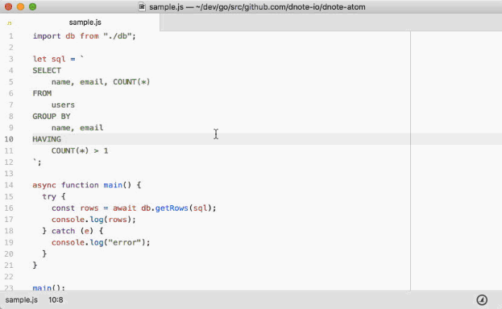

# Dnote Atom

Capture your learning inside the Atom editor.

Unless we write down what we learn, we forget exponentially. Write down things as you learn without a distraction.

## Install

    apm install dnote-atom

Or download from Atom Settings.

**Required**

This package requires [Dnote CLI](https://github.com/dnote-io/cli) and integrates with it.

## Use

Ways to write a new note:

* <kbd>ctrl</kbd> + <kbd>shfit</kbd> + <kbd>d</kbd>
* Click a shortcut in the status bar

## How It Works

Dnote Atom writes notes using Dnote CLI. This means:

* You own all your notes locally, and they can be browsed using the CLI.
* You can optionally sync it to [Dnote Cloud](https://dnote.io/cloud).
* You can instantly write down notes without switching context while using Atom.

## Links

* [Dnote](https://dnote.io)
* [Writing Down Every Lesson While Coding for a Month](https://dnote.io/blog/writing-everything-i-learn-coding-for-a-month/)

## License

MIT
